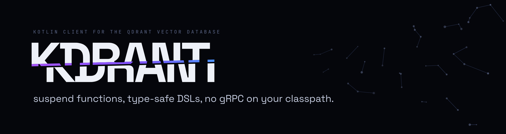

<p align="center">
  
</p>

# Kdrant

**An idiomatic, coroutine-first Kotlin client for the [Qdrant](https://qdrant.tech) vector database.**

[](https://github.com/NaCode-Studios/Kdrant/actions/workflows/ci.yml)
[](https://central.sonatype.com/artifact/io.github.nacode-studios/kdrant-core)
[](LICENSE)
[](https://kotlinlang.org)
[](https://nacode-studios.github.io/Kdrant/)
[](https://nacodestudios.it/en/project/kdrant)

Qdrant's official JVM client is built for Java: every call returns a `ListenableFuture`, requests
are assembled with protobuf builders, and it pulls a large gRPC/Netty stack onto your classpath.
Kdrant is the client you'd actually want to write Kotlin against: `suspend` functions, a type-safe
DSL, `kotlinx-serialization` models, and a small, coroutine-native footprint.

```kotlin
val qdrant = Kdrant(host = "localhost", port = 6333) {
    apiKey = System.getenv("QDRANT_API_KEY")
    requestTimeout = 5.seconds
}

qdrant.use { client ->
    client.createCollection("articles") {
        vector { size = 1_536; distance = Distance.COSINE }
    }

    client.upsert("articles", wait = true) {
        point(id = 1) {
            vector(embedding)
            payload("title" to "Introduction", "lang" to "en", "year" to 2026)
        }
    }
}
```

Kdrant stores and searches vectors you already have. `embedding` above is a `List<Float>` from
your own embedding model; Kdrant does not generate embeddings.

> **See it end to end.** [`example-rag`](example-rag/) is a small runnable Retrieval-Augmented-Generation
> service (ingest, embed, store, retrieve) built on Kdrant, with a `docker-compose` for Qdrant.

> **Status — `1.2`, stable.** The REST client is feature-complete: collections, `upsert`, the modern
> `/points/query` search (nearest, hybrid fusion, recommend/discover/context, batch, groups), sparse
> and multi-vectors, `scroll`, payload and vector management, aliases, snapshots, service/analytics
> endpoints, resilient retries, and the full filter DSL, plus Spring Boot, Spring AI and LangChain4j
> integrations. The public API is stable under SemVer; see [STABILITY.md](STABILITY.md).

## Why Kdrant

- Every operation is a `suspend` function. Cancellation and timeouts are cooperative, and
  `CancellationException` is always propagated.
- Collections, points, payloads and filters are built declaratively through scope-isolated builders
  (`@DslMarker`) rather than verbose request objects.
- The engine is pure Kotlin REST on Ktor and kotlinx-serialization, which keeps gRPC, Netty and
  protobuf off your classpath.
- Failures surface as a sealed `KdrantException` you can handle exhaustively.
- The wire protocol sits behind a `QdrantTransport` seam, so the public API stays independent of it.

### Footprint vs the official client

Dependency stacks verified against `io.qdrant:client:1.18.3`:

| | Kdrant (`kdrant-transport-rest`) | Official `io.qdrant:client` |
| --- | --- | --- |
| Wire protocol | REST/HTTP over Ktor CIO | gRPC (HTTP/2) |
| Heavy dependencies | none, pure Kotlin (Ktor + kotlinx) | `grpc-netty-shaded` (bundled Netty), `grpc-protobuf`/`grpc-stub`, `protobuf-java`, Guava, slf4j |
| Approx. added footprint | ~3-5 MB (Ktor + kotlinx-serialization; coroutines/stdlib are usually already present) | ~15-20 MB of transitive jars (shaded Netty ≈ 9 MB alone) |
| API style | `suspend` functions + `Flow`, type-safe DSL | `ListenableFuture<T>` (Guava), protobuf builders |
| Models | `kotlinx-serialization` data classes | generated protobuf messages |
| GraalVM native / cold start | friendly (no Netty/protobuf reflection config) | needs gRPC/Netty/protobuf native config; heavier cold start |

For raw throughput and streaming, gRPC/HTTP2 still wins. That case now has an answer inside Kdrant:
`kdrant-transport-grpc` is an opt-in engine behind the same `QdrantClient`, so the column above stays
true of the default and a build that does not ask for gRPC never pays for it. For typical RAG and
embedding-search workloads, REST trades the wire for a fraction of the footprint and idiomatic Kotlin.

## Installation

Requires JDK 17+. Artifacts are published to Maven Central under `io.github.nacode-studios`.

```kotlin
dependencies {
    implementation("io.github.nacode-studios:kdrant-transport-rest:1.2.0")
}
```

`kdrant-transport-rest` brings in `kdrant-core` transitively; it is the only dependency you add. To use
the gRPC engine instead, depend on `kdrant-transport-grpc` and build the client with `KdrantGrpc(host)`;
nothing else in this README changes, because the API above the wire is the same API.

`kdrant-core` is a Kotlin Multiplatform library and publishes one artifact per target. A Gradle build
resolves the right one from the `kdrant-core` coordinate and needs no change. A Maven build names the
artifact directly and wants `kdrant-core-jvm`. The engines and adapters are JVM-only and are unaffected.

You also need a running Qdrant. For local development:

```bash
docker run -p 6333:6333 qdrant/qdrant
```

## Usage

### Connecting

```kotlin
val qdrant: QdrantClient = Kdrant(host = "localhost", port = 6333) {
    apiKey = "..."          // sent as the api-key header; omit for a local, unauthenticated node
    useTls = true           // required in production when sending an API key
    requestTimeout = 10.seconds
}
```

`QdrantClient` is `AutoCloseable`; use it with `use { }` or close it explicitly.

### Collections

```kotlin
// Single (anonymous) vector
qdrant.createCollection("articles") {
    vector { size = 1_536; distance = Distance.COSINE }
    onDiskPayload = true
}

// Named vectors
qdrant.createCollection("multimodal") {
    namedVector("text") { size = 768; distance = Distance.COSINE }
    namedVector("image") { size = 512; distance = Distance.DOT }
}

qdrant.deleteCollection("articles")
```

Create-if-absent (race-tolerant), plus a size+distance shorthand for the common case and a
non-throwing read:

```kotlin
// Returns true if created, false if it already existed (tolerates a concurrent create).
qdrant.createCollectionIfNotExists("articles") { vector { size = 1_536; distance = Distance.COSINE } }
qdrant.createCollection("quickstart", size = 1_536)      // single vector, COSINE

val info = qdrant.getCollectionOrNull("articles")        // null instead of throwing if absent
```

### Upserting points

Point ids are unsigned integers or UUID strings. Payloads accept heterogeneous JSON values.

```kotlin
qdrant.upsert("articles", wait = true) {
    point(id = 1) {
        vector(0.12f, 0.87f, 0.03f /* ... */)
        payload("title" to "Intro", "tags" to listOf("nlp", "kotlin"))
    }
    point(id = "550e8400-e29b-41d4-a716-446655440000") {
        vector("text" to textEmbedding, "image" to imageEmbedding)
        payload {
            put("title", "Cover")
            put("score", 0.91)
        }
    }
}
```

Large batches are split automatically to stay under Qdrant's request-size limit; tune it with
`Kdrant(host, port, upsertBatchSize = 500)`.

### Filters

The filter DSL mirrors Qdrant's filtering model (`must` / `should` / `mustNot` / `minShould`, every
condition type, recursive nesting) and powers both `search` and delete-by-filter:

```kotlin
val query = filter {
    must {
        "lang" eq "en"
        "year" gte 2024
        "price" between 10.0..99.0
    }
    should {
        matchAny("tag", "featured", "promo")
        geoRadius("location", GeoPoint(lon = 13.40, lat = 52.52), radius = 5_000.0)
    }
    mustNot { "archived" eq true }
}
```

Supported conditions include exact/any/except and full-text match, numeric and datetime ranges,
`values_count`, geo bounding-box / radius / polygon, `is_empty` / `is_null`, `has_id`,
`has_vector`, per-element `nested` filters, and recursive `filter { }` sub-groups.

### Searching

```kotlin
val hits: List<ScoredPoint> = qdrant.search("articles") {
    query(queryVector)
    limit = 5
    scoreThreshold = 0.75
    withPayload = WithPayload.include("title")
    filter { must { "lang" eq "en" } }
}
```

Decode each hit's payload straight into your own type with `searchAs` (or `payloadAs` on a single hit):

```kotlin
@Serializable data class Article(val title: String, val lang: String)

val articles: List<Hit<Article>> = qdrant.searchAs<Article>("articles") {
    query(queryVector); limit = 5
}
val first: Article? = articles.firstOrNull()?.payload
```

Hybrid search fuses several `prefetch` sources with Reciprocal Rank Fusion or DBSF:

```kotlin
val hits = qdrant.search("articles") {
    prefetch { query(titleVector); using = "title"; limit = 50 }
    prefetch { query(bodyVector); using = "body"; limit = 50 }
    rrf()            // Reciprocal Rank Fusion; or dbsf()
    limit = 10
}
```

You can also query by a stored point's vector (`query(PointId.num(1))`), `orderBy("field")`, or
`sample()`. Sparse vectors (`querySparse(indices, values)`) and multi-vectors (`queryMulti(...)`) are
supported too. Combine a dense and a sparse prefetch under `rrf()` for real dense plus keyword hybrid
search, after declaring them with `namedVector(...)` and
`sparseVector("keywords") { modifier = Modifier.IDF }`.

### Scrolling

`scroll` returns a cold `Flow` that transparently pages through the collection:

```kotlin
qdrant.scroll("articles", pageSize = 256) {
    filter { must { "lang" eq "en" } }
}.collect { record -> /* ... */ }
```

### Deleting

```kotlin
qdrant.delete("articles", ids = listOf(PointId.num(1), PointId.uuid("...")))
qdrant.delete("articles") { must { "lang" eq "en" } }   // by filter
```

### Counting & retrieving

```kotlin
val total = qdrant.count("articles")
val english = qdrant.count("articles") { must { "lang" eq "en" } }

val points: List<Record> = qdrant.retrieve("articles", ids = listOf(PointId.num(1), PointId.num(2)))
```

### Error handling

```kotlin
try {
    qdrant.upsert("articles") { /* ... */ }
} catch (e: KdrantException.CollectionNotFound) {
    // the collection does not exist
} catch (e: KdrantException.Unauthorized) {
    // missing or wrong API key
}
```

Prefer a `Result`? `catching { }` is a coroutine-safe `runCatching`: it wraps the outcome but always
re-throws `CancellationException`:

```kotlin
val hits = catching { qdrant.search("articles") { query(queryVector) } }.getOrElse { emptyList() }
```

## Architecture

Three modules keep protocol concerns out of the public API:

| Module | Contents |
| --- | --- |
| `kdrant-core` | Public API (`QdrantClient`), models, DSLs, error hierarchy, and the `QdrantTransport` seam, with no wire-protocol knowledge. |
| `kdrant-transport-rest` | The default REST engine (Ktor CIO) implementing `QdrantTransport`, plus the `Kdrant(...)` factory. |
| `kdrant-transport-grpc` | The opt-in gRPC engine over Qdrant's own protobuf services, plus the `KdrantGrpc(...)` factory. Depend on it only if you want it. |

`kdrant-core` builds for the JVM and for eight Kotlin/Native targets: iOS, macOS, Linux and Windows.
That is what the transport seam bought — the models, DSLs and client logic never knew about a wire, so
they compile anywhere Kotlin does. The engines stay JVM-only, because Ktor CIO and grpc-java are, so a
multiplatform consumer today shares its models and its query building and supplies its own transport.
Kotlin/JS is left out for that reason rather than an accident of effort: with no JS engine the target
would ship a DSL with nothing to send.

The DSLs and client logic live in `kdrant-core` and are independent of the protocol; only an engine
module knows about a wire. Both engines are held to the same behavioural test suite, so the choice is
a footprint and throughput decision rather than a feature one — with the exception of the operations
Qdrant serves over HTTP only, which the gRPC engine names rather than degrading.

## Roadmap

**Shipped (`1.2.0`).** Tier 6 closes the gaps that made adoption harder than it needed to be:
metadata-filter translation in the Spring AI and LangChain4j adapters, so a filtered RAG application is
a genuine drop-in swap; contract tests validating every request body against Qdrant's OpenAPI document,
so a wire change is a failing build rather than a silent difference; `ensureCollection`, an ordered
`scroll` that resumes, and `batchUpdate` for rerunnable bootstrap scripts and resumable ETL; a
`kdrant-micrometer` module, `X-Request-Id` correlation and connection-pool settings; and a
[migration guide from `io.qdrant:client`](docs/migrating-from-qdrant-client.md) with
[measured latency](benchmarks/README.md#measured-latency) behind it. On top of the earlier
`1.x` line: collection aliases, snapshots with streaming backup and restore, the service, health and
analytics endpoints, a granular transport seam with a `FloatArray` no-boxing hot path, the modern
`/points/query` engine (hybrid RRF/DBSF fusion, sparse and multi-vectors, recommend / discover /
context, batch and grouped search), payload and vector management, and typed-payload DX. Upgrading
from `1.1.0` is a recompile rather than a jar swap — see
[STABILITY.md](STABILITY.md#what-may-still-change-in-a-minor); the [CHANGELOG](CHANGELOG.md) has the
version-by-version detail.

**Merged, unreleased.** The opt-in gRPC engine, `kdrant-transport-grpc`, and the move of `kdrant-core`
to Kotlin Multiplatform. Both are in `main` and neither has shipped; see the
[CHANGELOG](CHANGELOG.md#unreleased) for what they change and what the multiplatform move does to
`kdrant-core`'s artifact coordinates.

The plan lives on the [Kdrant board](https://github.com/orgs/NaCode-Studios/projects/4) — one item per milestone, each with its
exit criterion — and every tier is a [milestone](https://github.com/NaCode-Studios/Kdrant/milestones) in this repository. See
[STABILITY.md](STABILITY.md) for the versioning and stability policy.

## Building and testing

```bash
./gradlew build         # compile, run unit tests, lint (ktlint + detekt), verify public API
./gradlew apiCheck      # check the tracked public API in *.api
./gradlew apiDump       # regenerate *.api after an intentional public-API change
./gradlew ktlintFormat  # auto-fix formatting before committing
```

Unit tests need no external services. Integration tests spin up a real Qdrant with
[Testcontainers](https://testcontainers.com) and are skipped automatically when Docker is
unavailable.

## Contributing

Contributions are welcome; see [CONTRIBUTING.md](CONTRIBUTING.md). Please run `./gradlew build`
before opening a pull request, and if you change the public API, run `./gradlew apiDump` and commit
the updated `*.api` files.

## License

Licensed under the [Apache License 2.0](LICENSE). Brand assets (wordmark, symbol, and the colour and
type tokens) are in [`docs/brand`](docs/brand).

## Sponsor

If Kdrant is useful to you, consider [sponsoring NaCode Studios](https://github.com/sponsors/NaCode-Studios).
